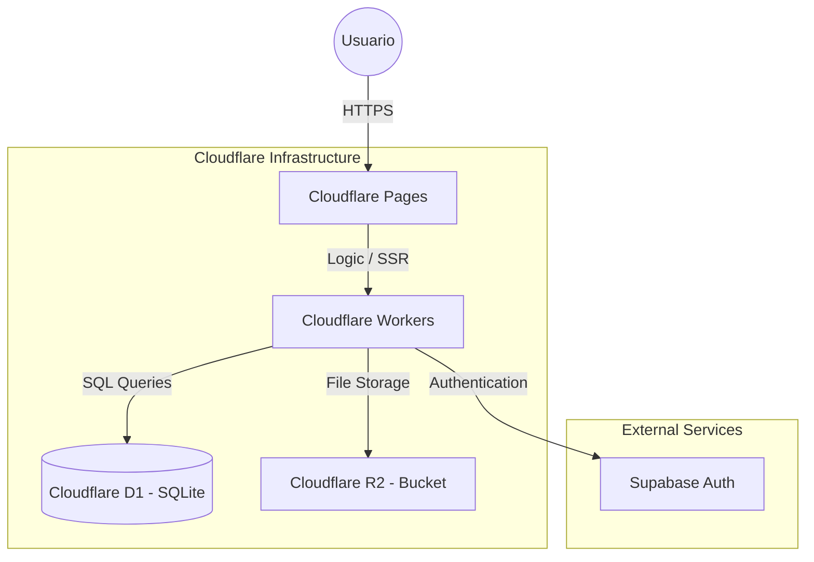

# Chambar - Sistema de Gestión de Caja Chica 🚀

Chambar es una plataforma web de alto rendimiento diseñada para la gestión operativa y financiera de múltiples cajas chicas, stands y empresas. Construida sobre la infraestructura "Edge" de Cloudflare, garantiza baja latencia y alta disponibilidad.

## 🏗️ Arquitectura del Sistema

El sistema utiliza una arquitectura **Serverless** moderna, aprovechando al máximo el ecosistema de Cloudflare para el almacenamiento y la lógica.



## 🛠️ Stack Tecnológico

*   **Frontend & Backend:** [SvelteKit 2](https://kit.svelte.dev/) con modo SSR (Server Side Rendering).
*   **Base de Datos:** [Cloudflare D1](https://developers.cloudflare.com/d1/) (Base de datos SQL distribuida).
*   **Almacenamiento de Archivos:** [Cloudflare R2](https://developers.cloudflare.com/r2/) (Compatible con S3 para adjuntos y miniaturas).
*   **ORM:** [Drizzle ORM](https://orm.drizzle.team/) para un tipado seguro de la base de datos.
*   **Gráficos:** [TradingView Lightweight Charts](https://www.tradingview.com/lightweight-charts/) para análisis financiero.
*   **Autenticación:** [Supabase Auth](https://supabase.com/auth).
*   **Estilos:** CSS Vanilla con diseño premium y micro-animaciones.

## 🚀 Guía de Instalación

### Requisitos previos
*   Node.js (v18 o superior).
*   `pnpm` instalado.
*   Cloudflare Wrangler CLI (`npm install -g wrangler`).

### Pasos para desarrollo local
1.  **Clonar el repositorio:**
    ```bash
    git clone [url-del-repo]
    cd Chambar_PE_SC
    ```

2.  **Instalar dependencias:**
    ```bash
    pnpm install
    ```

3.  **Configurar variables de entorno:**
    Crea un archivo `.env` basado en `.env.example` con tus credenciales de Supabase.

4.  **Iniciar base de datos local:**
    ```bash
    pnpm run db:migrate:local
    ```

5.  **Correr servidor de desarrollo:**
    ```bash
    pnpm run dev
    ```

## 📦 Despliegue a Producción

Para subir los cambios a la URL principal:

1.  **Construir el proyecto:**
    ```bash
    pnpm run build
    ```

2.  **Desplegar a Cloudflare Pages:**
    ```bash
    npx wrangler pages deploy .svelte-kit/cloudflare --branch main
    ```

## 📖 Guía de Uso para el Usuario

### 1. Gestión de Cajas Chica
*   **Apertura:** Toda caja comienza en estado `Vacía`. Al abrirla, se define un `Monto de Apertura` y la `Fecha de Negocio` (Business Date).
*   **Cierre:** Al cerrar la caja, el saldo actual se guarda y la caja queda inactiva.
*   **Reapertura:** Si hay un error, se puede reaperturar una caja cerrada indicando el motivo.

### 2. Registro de Operaciones
*   **Ingresos/Egresos:** Permite registrar movimientos de dinero asociados a una caja abierta.
*   **Adjuntos:** Puedes subir fotos de recibos o facturas. El sistema genera automáticamente miniaturas (thumbnails) para optimizar la carga.
*   **Campos Opcionales:** El `Stand` es opcional, lo que permite registrar gastos generales de la empresa.

### 3. Reportes y Análisis
*   **Dashboard Inicio:** Resumen en tiempo real de ingresos, egresos y saldo total en todas las cajas activas.
*   **Análisis de Negocio:** Gráficos detallados de balance diario y distribución de gastos por categoría.

## 🗂️ Estructura del Proyecto

*   `/src/routes`: Páginas y endpoints de la API (SvelteKit).
*   `/src/lib/db`: Definición de esquemas de base de datos y migraciones.
*   `/src/lib/services`: Lógica de negocio (CRUD de operaciones, cajas, etc.).
*   `/src/lib/components`: Componentes UI reutilizables (Modales, Tablas, Gráficos).

---
Desarrollado con ❤️ para el equipo de **Chambar**.
